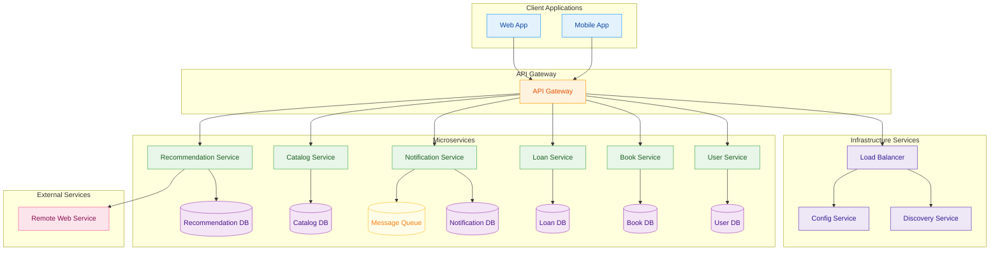

# Library Management System (LMS)

## 📚 Table of Contents
- [Overview](#overview)
- [Features](#features)
- [Tech Stack](#tech-stack)
- [Architecture Diagram](#architecture-diagram)
- [Module Overview](#module-overview)
  - [Book Service](#book-service)
  - [Member Service](#member-service)
  - [Transaction Service](#transaction-service)
  - [Fine Service](#fine-service)
  - [Notification Service](#notification-service)
  - [API Gateway](#api-gateway)
  - [Discovery Server (Eureka)](#discovery-server-eureka)
- [Setup Instructions](#setup-instructions)
- [Testing](#testing)
- [Deployment](#deployment)
- [Contributing](#contributing)
- [License](#license)

## Overview
The Library Management System (LMS) is a RESTful API-based backend application designed to manage book collections, member registrations, borrowing and returning of books, overdue tracking, and notifications. It is built using Spring Boot and supports relational databases like MySQL and PostgreSQL.

---

## Features
- **Book Management**: Add, update, delete, and search books.
- **Member Management**: Register and manage library members.
- **Borrowing and Return**: Track book borrowing and return processes.
- **Overdue and Fines**: Monitor overdue books and calculate fines.
- **Notifications**: Send alerts for due dates and fines.

---

## Tech Stack

- Java 
- Spring Boot 
- Spring Data JPA
- MySQL
- Springdoc OpenAPI (Swagger)
- Eureka Discovery Client

---
## Architecture Diagram

---
##  Module Overview

The Library Management System is built using a microservices architecture. Each module handles a specific business capability and communicates via REST APIs. Below is a quick summary:

### [Book Service](./book-service/README.md)
Handles the library's book catalog. Responsible for adding, updating, searching, and listing books, along with managing availability status (e.g., available, issued, reserved).


### [Member Service](./member-service/README.md)
Manages all library members: registration, updates, lookups, and status changes. Exposes endpoints to search and retrieve member details and supports member lifecycle management.


### [Transaction Service](./transaction-service/README.md)
Manages the issuance and return of books by members. Ensures book availability, tracks due dates, and maintains borrowing history. Coordinates with both Member and Book services.

### [Fine Service](./fine-service/README.md)
Calculates and manages overdue fines for borrowed books. It tracks return deadlines, applies configurable penalty rules, and exposes endpoints for querying outstanding dues. Integrates with the Borrowing Service to detect overdue returns and can trigger notifications via the Notification Service.


### [ Notification Service](./notification-service/README.md)
Sends alerts and reminders to users. Used to notify members about upcoming due dates, overdue returns, registration confirmations, and system messages (via email, SMS, etc.).

  
### [API Gateway](./api-gateway)
Provides a unified entry point to route incoming client requests to appropriate microservices. Also handles load balancing, logging, and cross-cutting concerns.
Access the API documentation at `http://localhost:8080/swagger-ui.html`.

###  [Discovery Server (Eureka)](eureka-server)
Acts as a service registry where all microservices register themselves. Enables dynamic service discovery and communication within the ecosystem.

Eureka Discovery : http://localhost:8761/

---
## Setup Instructions
1. Clone the repository:
   ```bash
   git clone repository
   cd /Library-Management-System
   ```
2. Build and run the application:
   ```bash
   cd {service-name}
   mvn spring-boot:run
   ```

## Testing
Run the tests using Maven:
```bash
mvn test
```
---

## Contributing
Contributions are welcome! Please see the [CONTRIBUTING](CONTRIBUTING.md)

## License
This project is licensed under the [MIT License](LICENSE)
