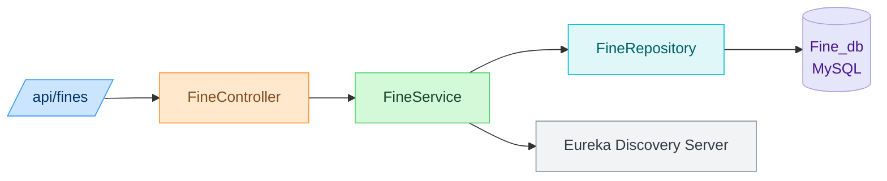
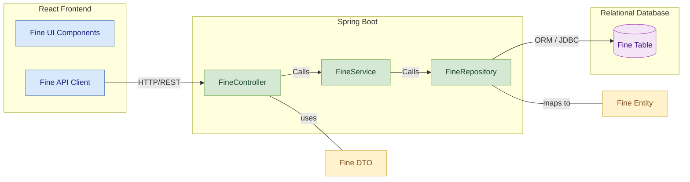
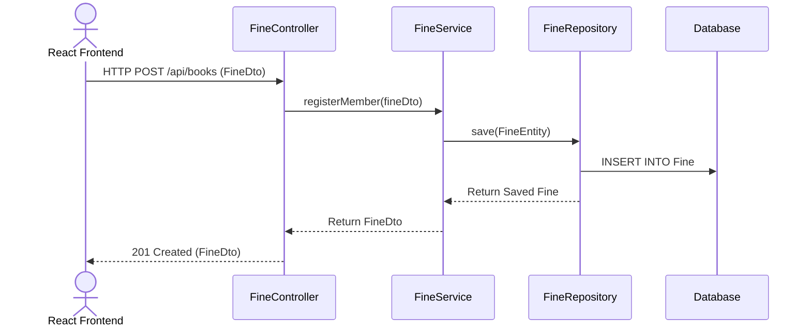
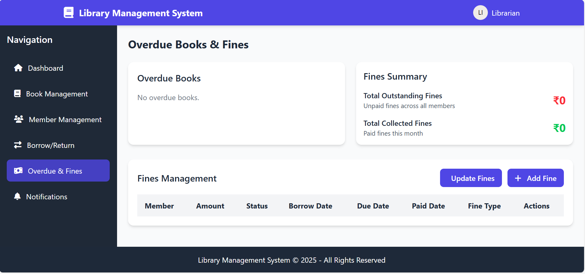

#  Fine Service

##  Contributor
- Nehal Rane
  
## 📚 Table of Contents
- [Overview](#overview)
- [Features](#features)
- [Folder Structure](#folder-structure)
- [REST API Endpoints](#rest-api-endpoints)
- [Data Model](#data-model)
- [Module Architecture Diagram](#module-architecture-diagram)
- [Component Diagram](#component-diagram)
- [Sequence Diagram](#sequence-diagram)
- [Integration](#integration)
- [Run Locally](#run-locally)

## Overview
- The **Fine Service** handles overdue tracking and fine calculations in the Library Management System. It monitors late returns from the Borrowing Service, calculates penalties based on overdue days, and enables members to view and pay fines. It operates independently and is integrated through Eureka for discoverability.

---

##  Features
- Track and calculate fines for overdue books
- Associate fines with borrowing transactions or members
- Mark fines as paid or pending
- Provide fine summaries by member
- Support fine payment status updates

---
## Folder Structure
<pre>
src/
└── main/
    ├── java/
    │   └── com.library.book/
    │       ├── controller/       # REST controllers
    │       ├── dto/              # Data Transfer Objects
    │       ├── entity/           # JPA Entities
    │       ├── repository/       # Spring Data Repositories
    │       └── service/          # Business logic layer
    └── resources/
        └── application.properties  # App configuration
</pre>
---
##  REST API Endpoints

| Method | Endpoint                                      | Description                                           |
|--------|-----------------------------------------------|-------------------------------------------------------|
| GET    | `/api/fines`                                  | Retrieve all fines                                    |
| GET    | `/api/fines/collected`                        | Get total collected fines                             |
| GET    | `/api/fines/pending`                          | Get total pending fines                               |
| GET    | `/api/fines/{id}`                             | Retrieve a fine by ID                                 |
| GET    | `/api/fines/member/{memberId}`                | Retrieve fines by member ID                           |
| GET    | `/api/fines/member/{memberId}/total`          | Get total pending fines for a specific member         |
| POST   | `/api/fines/{transactionId}/{fineType}`       | Create a fine for a transaction                       |
| PUT    | `/api/fines/{id}/pay`                         | Pay a fine                                            |
| PUT    | `/api/fines/{id}/reverse`                     | Reverse a fine payment                                |
| PUT    | `/api/fines/{id}/cancel`                      | Cancel a fine                                         |
| PUT    | `/api/fines/update-fines`                     | Process and update overdue fines                      |
| DELETE | `/api/fines/{id}`                             | Delete a fine by ID                                   |


> Swagger UI available at: `/swagger-ui/index.html`

---

##  Data Model

### `Fine` Entity

| Field            | Type      | Description                           |
|------------------|-----------|---------------------------------------|
| fineId           | BIGINT    | Primary key                           |
| memberId         | BIGINT    | Foreign key to `Member`               |
| amount           | DECIMAL   | Fine amount calculated                |
| status           | VARCHAR   | PENDING / PAID                        |
| transactionDate  | DATE      | When fine was assessed or paid        |

---
##  Module Architecture Diagram 



---
## Component diagram
 

---
## Sequence Diagram

---
##  Integration

- **Borrowing Service**: triggers fine creation when books are overdue
- **Notification Service** **: sends reminders to users with pending fines

---
## UI Section


  
---

##  Run Locally
```bash
#for Backend :
# Navigate to the folder
cd book-service
# Build and run
mvn clean install
mvn spring-boot:run

#for frontend :
# Install dependencies
npm install
# Start the development server
npm run dev
