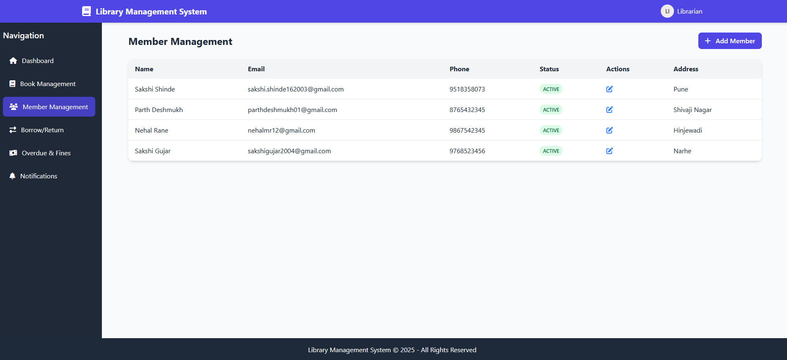

#  Member Service

## Contributor
- Sakshi Shinde

## 📚 Table of Contents
- [Overview](#overview)
- [Features](#features)
- [Folder Structure](#folder-structure)
- [REST API Endpoints](#rest-api-endpoints)
- [Data Model](#data-model)
- [Module Architecture Diagram](#module-architecture-diagram)
- [Component Diagram](#component-diagram)
- [Sequence Diagram](#sequence-diagram)
- [UI Section](#ui-section)
- [Run Locally](#run-locally)

## Overview
- The Member Management Service is a standalone Spring Boot microservice responsible for handling member registration, profile updates, and managing the membership lifecycle in a Library Management System. It is designed for modularity, scalability, and integration within a microservices ecosystem via Eureka Discovery and Spring Cloud Gateway.
---
##  Features

- Register new members
- Search members by name or status
- Retrieve member by ID or email
- Update member details and status
- Delete or deactivate accounts

---
## Folder Structure
<pre>
src/
└── main/
    ├── java/
    │   └── com.library.member/
    │       ├── controller/       # REST controllers
    │       ├── dto/              # Data Transfer Objects
    │       ├── entity/           # JPA Entities
    │       ├── repository/       # Spring Data Repositories
    │       └── service/          # Business logic layer
    └── resources/
        └── application.properties  # App configuration
</pre>
---

##  REST API Endpoints

| Method | Endpoint                          | Description                                          |
|--------|-----------------------------------|------------------------------------------------------|
| GET    | `/api/members`                    | Retrieve all members                                 |
| GET    | `/api/members/{id}`               | Retrieve a member by ID                              |
| GET    | `/api/members/email/{email}`      | Retrieve a member by email                           |
| GET    | `/api/members/status/{status}`    | Retrieve members by membership status                |
| GET    | `/api/members/search?name={name}` | Search members by name                               |
| POST   | `/api/members`                    | Create a new member                                  |
| PUT    | `/api/members/{id}`               | Update an existing member                            |
| DELETE | `/api/members/{id}`               | Delete a member by ID                                |
| PUT    | `/api/members/{id}/{status}`      | Update membership status of a member                 |


---

##  Data Model

### Member Entity

| Field             | Type     | Description                  |
|-------------------|----------|------------------------------|
| `memberId`        | BIGINT   | Primary key, auto-generated  |
| `name`            | VARCHAR  | Member's full name           |
| `email`           | VARCHAR  | Must be unique               |
| `phone`           | VARCHAR  |                              |
| `address`         | VARCHAR  |                              |
| `membershipStatus`| ENUM     | `ACTIVE` / `INACTIVE`        |
| `registrationDate`| DATE     | Member's onboarding date     |

---
##  Module Architecture Diagram 

```mermaid
flowchart LR
  A[/api/members/] --> B[MemberController]
  B --> C[MemberService]
  C --> D[MemberRepository]
  D --> E[(member_db<br>MySQL)]
  C --> F[Eureka Discovery Server]

  %% Color Scheme Styling
  classDef endpoint fill:#cce5ff,stroke:#339af0,color:#003566
  classDef controller fill:#ffe8cc,stroke:#ff922b,color:#7f4f24
  classDef service fill:#d3f9d8,stroke:#51cf66,color:#1b4332
  classDef repository fill:#e0f7fa,stroke:#00bcd4,color:#006064
  classDef database fill:#e6e6fa,stroke:#b39ddb,color:#4a148c
  classDef registry fill:#f1f3f5,stroke:#868e96,color:#343a40

  class A endpoint
  class B controller
  class C service
  class D repository
  class E database
  class F registry
```

_This diagram illustrates the layered architecture:_

- API Gateway routes requests
- MemberController handles HTTP requests
- Business logic sits in MemberService
- Data access is handled by MemberRepository
- Data is persisted to a MySQL database
- The service is registered with Eureka for discovery

## Component Diagram
```mermaid
flowchart LR

  %% Groups
  subgraph Frontend [React Frontend]
    direction TB
    A1[Member UI Components]
    A2[Member API Client]
  end

  subgraph Backend [Spring Boot]
    direction TB
    B1[MemberController]
    B2[MemberService]
    B3[MemberRepository]
  end

  subgraph Database [Relational Database]
    direction TB
    C1[(Members Table)]
  end

  %% Entity and DTO
  D1[Member DTO]
  D2[Member Entity]

  %% Connections
  A2 -->|HTTP/REST| B1
  B1 -->|Calls| B2
  B2 -->|Calls| B3
  B3 -->|ORM / JDBC| C1

  B1 ---|uses| D1
  B3 ---|maps to| D2

  %% Styling
  classDef frontend fill:#dae8fc,stroke:#6c8ebf,color:#1a237e
  classDef backend fill:#d5e8d4,stroke:#82b366,color:#1b4332
  classDef storage fill:#e8def8,stroke:#8e44ad,color:#4a148c
  classDef model fill:#fff2cc,stroke:#d6b656,color:#7f4f24

  class A1,A2 frontend
  class B1,B2,B3 backend
  class C1 storage
  class D1,D2 model
```

## Sequence Diagram
```mermaid
sequenceDiagram
  actor UI as React Frontend
  participant C as MemberController
  participant S as MemberService
  participant R as MemberRepository
  participant DB as Database

  UI->>C: HTTP POST /api/members (MemberDto)
  C->>S: registerMember(memberDto)
  S->>R: save(memberEntity)
  R->>DB: INSERT INTO Members
  R-->>S: Return Saved Member
  S-->>C: Return MemberDto
  C-->>UI: 201 Created (MemberDto)

  %% Styling (as comments for Mermaid, no visual impact)
  %% UI:       #dae8fc (soft blue)
  %% Controller/Service/Repo: #d5e8d4 (light green)
  %% DB:       #f3e5f5 (lavender)
```
---

- Swagger Url : http://localhost:8081/swagger-ui/index.html#/
- Eureka Discovery : http://localhost:8761/

---
## UI Section


---
##  Run Locally
```bash
#for Backend :
# Navigate to the folder
cd book-service
# Build and run
mvn clean install
mvn spring-boot:run

#for frontend :
# Install dependencies
npm install
# Start the development server
npm run dev
